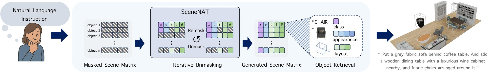
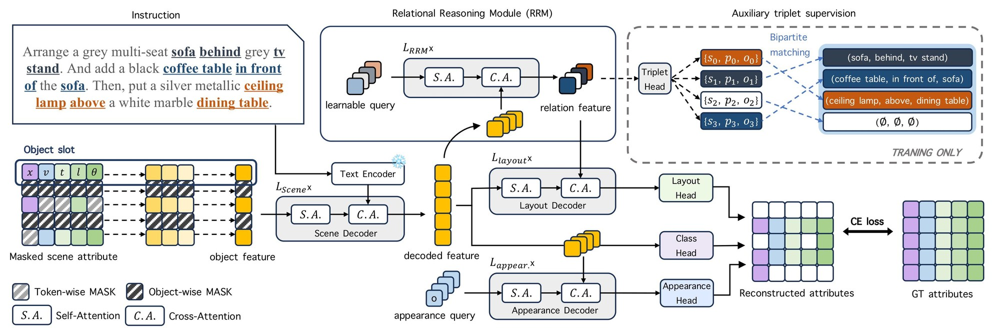
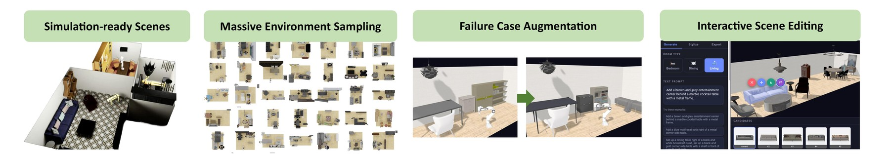

<div align="center">

# SceneNAT

### Masked Generative Modeling for Language-Guided Indoor Scene Synthesis

[Jeongjun Choi](https://scholar.google.com/citations?user=dkmtd6MAAAAJ)\*, &nbsp;
[Yeonsoo Park](https://scholar.google.com/citations?user=GcEA69UAAAAJ)\*, &nbsp;
[H. Jin Kim](https://scholar.google.com/citations?user=TLQUwIMAAAAJ)

Seoul National University &nbsp;•&nbsp; <sub>\*Equal contribution</sub>

[](https://scenenat.github.io)
[](https://arxiv.org/abs/2601.07218)
[](https://arxiv.org/pdf/2601.07218)
[](LICENSE)



</div>

---

## ✨ Overview

SceneNAT turns a natural-language instruction into a complete 3D indoor scene in **a few
parallel decoding passes** — no autoregressive object-by-object rollout, no hundreds of
diffusion steps.

- 🎭 **Masked generative modeling.** Semantic and spatial attributes are fully discretized
  and trained by masked modeling, with masking applied at both the *attribute* and
  *instance* level to capture intra- and inter-object structure.
- 🔗 **Relational Reasoning Module (RRM).** Relation modeling is cast as a *set prediction*
  task. Learnable triplet queries extract structure-aware features that steer layout
  generation — and at inference SceneNAT **never decodes symbolic triplets**.
- ⚡ **Constant-cost inference.** Cost is set by the maximum object capacity, so it is
  *invariant to the number of objects actually generated*.
- 🏆 **State of the art on 3D-FRONT** in both semantic compliance and spatial arrangement
  accuracy, at substantially less computation than autoregressive and diffusion baselines.

<div align="center">

</div>

## 📦 Repository scope

A minimal reproduction release: everything needed to preprocess the data, train SceneNAT,
and reproduce the paper's evaluations and downstream tasks. Exploratory scripts,
superseded model revisions, and internal analysis tooling are not included.

```
src/models/     SceneNAT + ablations (wo_triplet, full_edge), VQ-VAE, CLIP encoders
src/data/       3D-FRONT / 3D-FUTURE datasets, instruction templates
src/tasks/      train, eval, downstream tasks
src/utils/      evaluator (iRecall, FID/KID, collision), rendering, logging
configs/        per-room configuration (bed, dining, living)
scripts/        training / evaluation / preprocessing launchers
dataset/        preprocessing scripts, official splits, filter lists
```

## 🔧 Installation

Requires Python 3.8+, CUDA 11.8+, and Conda.

```bash
conda create -n nat --file settings/packages.txt
conda activate nat

python -m pip install torch torchvision torchaudio --index-url https://download.pytorch.org/whl/cu118
python -m pip install -r settings/requirements.txt

python -c "import nltk; nltk.download('cmudict')"
python -m pip install openai-clip open-clip-torch matplotlib
```

## 📁 Dataset

SceneNAT is trained on [3D-FRONT](https://tianchi.aliyun.com/specials/promotion/alibaba-3d-scene-dataset)
with [3D-FUTURE](https://tianchi.aliyun.com/specials/promotion/alibaba-3d-future) assets,
using the preprocessing pipeline and OpenShape object features introduced by
[InstructScene](https://github.com/chenguolin/InstructScene).

```bash
# 1. Place 3D-FRONT and 3D-FUTURE under dataset/3D-FRONT/
# 2. Fetch the preprocessed InstructScene data
python src/data/download_instructscene_dataset.py
# 3. Build the pickled datasets
bash scripts/preprocess_dataset.sh
```

Official train/val/test splits (`dataset/*_threed_front_splits.csv`) and the invalid-scene /
blacklisted-asset filters are included here.

> [!NOTE]
> Evaluation renders floors and walls from texture images at `dataset/etc_texture_floor/`
> and `dataset/etc_texture_wall/` (see `src/utils/evaluator.py`). These are not
> redistributed — supply your own JPEG textures there, or repoint the paths.

## 🚀 Training

```bash
# Set roomtype (bed|dining|living), exp_name, model, and CUDA_VISIBLE_DEVICES first.
bash scripts/train_ddp.sh
```

Supports multi-GPU distributed training, automatic worker scaling, and resuming.

## 📊 Evaluation

```bash
bash scripts/eval.sh <model_version>                          # best checkpoint, all rooms
bash scripts/eval.sh <model_version> <checkpoint>             # specific checkpoint
bash scripts/eval.sh <model_version> <checkpoint> <room_type> # single room
```

`scripts/eval_ours.sh` reproduces the exact configuration reported in the paper.

Metrics: **iRecall** (instruction-following relation accuracy), **FID / CLIP-FID / KID**,
and physical plausibility (collision volume, navigability, accessibility, floor penetration).

## 🎨 Downstream tasks

```bash
bash scripts/downstream.sh <model_version> [task] [room_type] [checkpoint] [timesteps]
```

Tasks: `completion` · `rearrangement` · `stylization` · `uncond` · `layouto`

<div align="center">

</div>

## 📂 Outputs

```
output/<model_version>/<room_type>/
├── checkpoints/
├── eval_results/
└── visualizations/
```

## 📝 Citation

```bibtex
@article{choi2026scenenat,
  title={SceneNAT: Masked Generative Modeling for Language-Guided Indoor Scene Synthesis},
  author={Choi, Jeongjun and Park, Yeonsoo and Kim, H. Jin},
  journal={arXiv preprint arXiv:2601.07218},
  year={2026}
}
```

## 📄 License

Released under [CC BY-NC 4.0](https://creativecommons.org/licenses/by-nc/4.0/) — free to
share and adapt for non-commercial purposes with attribution. See [LICENSE](LICENSE) for
details and for the third-party components whose original licenses continue to apply.

## 🙏 Acknowledgements

Built on [InstructScene](https://github.com/chenguolin/InstructScene) and
[ATISS](https://github.com/nv-tlabs/ATISS) for data preprocessing and scene rendering, and
uses [OpenShape](https://github.com/Colin97/OpenShape_code) features for object retrieval.
We thank the authors for releasing their code.
